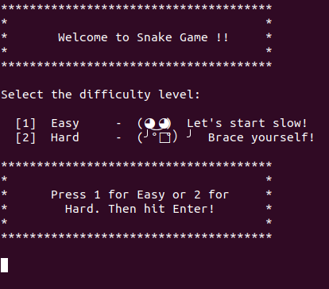
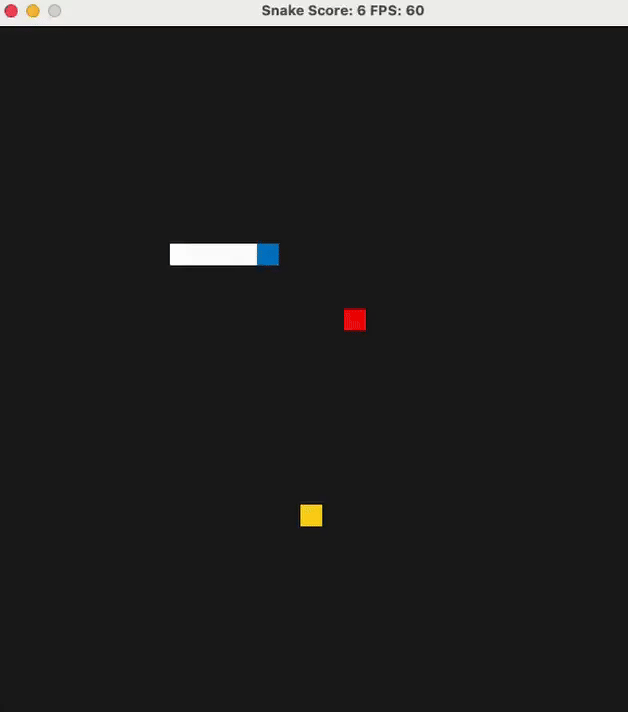

# Snake Game

Snake Game is a simple 2D C++ based game which is inspired from a Stackoverflow post and set of ansers to the post. The game is improvised with additional features and as a part of the project, some new features are added to the Snake Game, which makes it more like a real game. It uses the SDL game programming library in order to render and display the elements of the game.

The SDL library(opens in a new tab) is widely used for Game development as a tool to abstract the hardware so you don't need to worry about working with the hardware directly. SDL manages video, audio, input devices, and other components and provides you with a simple library interface.

## Snake Game Improvements and New Features

The Snake Game has been significantly improved with the addition of new features, making it more user-friendly and interactive. The key additions are:

 - **Pause/Resume Functionality:** sers can now pause and resume the game using keyboard inputs.
 - **Player Name Input:** Ability to enter the name of the player at game start.
 - **Game Difficulty Selection:** Players can choose the difficulty level (Easy or Hard) at the beginning of the game.
 - **Score and Player Name Saving:** The player's name and score are saved to a text file, allowing users to keep track of their performance.
 - **Special Food (Beta):** Special food appears randomly and changes the food's appearance in the game.

In the following sections, we will provide a detailed explanation of the newly added features. Additionally, we will cover the C++ concepts used in this project, offering a deeper understanding of the current implementation.

### Pause/Resume Functionality

For this feature, a new function called `pauseGame()` is added in the `controller.h` file. The logic is simple and based on the earlier implementation where a function takes input from the keyboard using `SDL_Event`. The keyboard key `'p'` is mapped to a function, such that when the key `'p'` is pressed, it pauses the game using `std::cin`, which essentially waits for input from the keyboard. This implementation is straightforward and effective for pausing the game.

```cpp
void Controller::pauseGame() const
{
  std::cout << "Game paused" << std::endl;
  std::cout << "enter 'S' to continue" << std::endl;
  std::g etline(std::cin, key_);
} 
```

### Player Name Input

This feature allows identifying the player by capturing their name. The player's name is entered via the keyboard and stored in a `std::string`, making it available for use later, such as saving it to a text file. This functionality is implemented in the newly added file `speedcontrol.cpp` within the `getPlayerName()` function, which handles capturing the input from the user.

```cpp
void speedcontrol::getPlayerName()
{
  std::cout << "Please Enter your name" << std::endl;
  std::getline(std::cin, playerName_);
}
```
### Game Difficulty Selection

This feature enhances the Snake Game by making the gameplay more intuitive through adjustable difficulty levels. The game asks the player to select a difficulty level at the start, which determines the initial speed of the snake. There are two difficulty levels: **Easy** and **Hard**, where the snake starts at different speeds. As the snake eats more food and grows, its speed increases.

This feature is implemented in the `speedcontrol.cpp` file. It uses several member functions and conditional statements to initialize the snake's speed based on the selected difficulty level before the game begins.


```cpp
oid speedcontrol::setSelection()
{
    switch(selection_)
    {
        case 1:
            speed_ = 0.1f;
            break;
        case 2:
            speed_ = 0.5f;
            break;
    }

}
```
To make the game more user-friendly, a nice UI is provided in the terminal when starting the game. This UI prompts the player to select the desired difficulty level in a visually appealing manner. The user can choose between **Easy** and **Hard** difficulty levels, which affect the initial speed of the snake. This enhances the overall gameplay experience by giving the player control over the game's difficulty.

<center></center>

### Score and Player Name Saving

It's always beneficial to store the player's name and score for future reference, whether to track the highest score or for historical purposes. In this project, at the end of the gameplay, the player’s name and corresponding score are written to a text file named **Gamestatics.txt**. This file is created if it doesn't exist, and if it does, the latest game details are **appended** at the end. This ensures that the latest data is always available at the bottom of the text file.

This functionality is implemented in the `game.cpp` file inside a function called `writeName()`. The function takes the player’s name from `speedcontrol.cpp` and writes it along with the score to the text file.


```cpp
void Game::writeName() 
{
  std::ofstream outputFile;
  outputFile.open("Gamestatics.txt", std::ios::app);

  auto playername = control->printPlayerName();
  if(outputFile){
    outputFile << "Player Name: " << playername << ", Score: " << score << std::endl;
    outputFile.close();
    std::cout << "The player Name and score was written to the file: Gamestatics.txt" << std::endl;
  }
  else {
    std::cerr << "File cannot be opened !!" << std::endl;
  }
}
```
 
### Special Food (beta)

This feature adds special food randomly among the normal food. The normal food is yellow in color, but when special food appears, the renderer changes its color to red. 

There is currently an issue with the real-time score updating. This is a known problem, and based on the current logic, it's challenging to find a solution. The feature is still in the beta phase and requires more changes.

<center></center>


## Project Rubrics

The following project rubrics have been completed in this project:

- **README**: A comprehensive README file is provided.
- **Compiling and Testing**: Ensured the game compiles correctly and has been thoroughly tested.
- **Loops, Functions, I/O**: Utilized loops, functions, and input/output for game mechanics and player interaction.
- **Object-Oriented Programming**: Employed OOP principles for designing the game structure and managing game objects.
- **Memory Management**: Proper memory management techniques are used, including resource cleanup and memory allocation where needed.


### README Overview

This README serves as a comprehensive documentation that explains the newly added features of the Snake Game as well as how to run it along with its dependencies. For more detailed instructions, please refer to the "Build Snake Game" section at the end of this README.

### Compiling and Testing

1) The submission must compile and run without errors on the Udacity project workspace.

The project uses **CMake** to generate the required make files. The parent directory contains the `CMakeLists.txt` file, which is updated with the new programs. 

It is recommended to create a directory called **build** and run the following commands:

```bash
mkdir build
cd build
cmake .. && make
```
The name of the game executable is **SnakeGame**, which can be launched using the following command:

```
./SnakeGame
```

### Loops, Functions, I/O

In the project, various control structures, functions, and input/output operations are utilized to improve the user interaction. The basic structure of the project is outlined below, and in this section, different usages of loops, functions, etc., are provided with links to specific implementations.

1) Project reads data from standard console and writes to a file  
2) Project accepts user input and processes the input
3) Project demonstrates an understanding of C++ functions and control structures

```
src/
 ├── controller.cpp
 ├── controller.h
 ├── game.cpp
 ├── game.h
 ├── main.cpp
 ├── renderer.cpp
 ├── renderer.h
 ├── snake.cpp
 ├── snake.h
 ├── speedcontrol.cpp
 └── speedcontrol.h
```
Below are the newly added functions:
- **In controller.cpp**  
  `void Controller::pauseGame() const`

- **In game.cpp**  
  `void Game::writeName()`  
  `void Game::writeNameToFile()`  
  `void Game::specialFood()`  
  `~Game()`

- **In main.cpp**  
  `game.writeNameToFile();`

- **In speedcontrol.cpp**  
  `void speedcontrol::speedSelection()`  
  `void speedcontrol::printMenu()`  
  `void speedcontrol::setSelection()`  
  `void speedcontrol::getPlayerName()`  
  `std::string speedcontrol::printPlayerName()`  
  `float speedcontrol::getSpeed()`

Control structures:

- **In controller.cpp**  
  Added a new case in the switch

- **In game.cpp**  
  Added an if statement in function Update()

- **In renderer.cpp**  
  Added an if statement in function Render()

- **In speedcontrol.cpp**  
  Added an switch statement in function setSelection()

I/O Operations

- **In controller.cpp**  
  Added the pause/resume function in pauseGame() using std::getline

- **In game.cpp**  
  Added the file writing function: writeName() using std::ofstream

- **In speedcontrol.cpp**  
  Added a speed selection input option using std::cin in speedSelection()
  Print to the standard console using printMenu()
  Get the player name using std::getline() in getPlayerName()


### Object Oriented Programming

1) One class is added to the project with appropriate access specifiers for class members
2) Class constructors utilize member initialization lists
3) Classes abstract implementation details from their interface

A new class `speedcontrol` is created inside the `speedcontrol.h` file in order to get the input from the user for the game difficulty selection. This class has public and private member variables and methods.

- **In speedcontrol.cpp**  
  Added a new class speedcontrol with public and private attributes

- **In snake.h**  
  Modified the constructor of class Snake to accept a new argument (speedcontrol *control)
  Initialise the member functions of class speedcontrol using the object.

- **In game.cpp**  
  Modified the order of the parameter list of Game class constructor
  Initiliase the memory dynamically inside the Game class constructor for the speedcontrol class object

### Memory Management

1) The project makes use of references in function declarations
2) The project uses destructors appropriately
3) The project uses scope / Resource Acquisition Is Initialization (RAII) where appropriate


- **In game.h/cpp**  
  Declared a dynamic object of class speedcontrol as private (speedcontrol *control;)
  Deleted the dynamic allocated variable control inside constructor
  In constructor, pass the pointer in the Snake class
  Used the control object to acess the member methods

- **In snake.h/cpp**  
  Declared a dynamic object of class speedcontrol as private (speedcontrol *controlSnake_;)
  Initialised in the constructor with the value from the Game class
  Used the control object to acess the member methods


## Dependencies for Running Locally
* cmake >= 3.7
  * All OSes: [click here for installation instructions](https://cmake.org/install/)
* make >= 4.1 (Linux, Mac), 3.81 (Windows)
  * Linux: make is installed by default on most Linux distros
  * Mac: [install Xcode command line tools to get make](https://developer.apple.com/xcode/features/)
  * Windows: [Click here for installation instructions](http://gnuwin32.sourceforge.net/packages/make.htm)
* SDL2 >= 2.0
  * All installation instructions can be found [here](https://wiki.libsdl.org/Installation)
  >Note that for Linux, an `apt` or `apt-get` installation is preferred to building from source. 
* gcc/g++ >= 5.4
  * Linux: gcc / g++ is installed by default on most Linux distros
  * Mac: same deal as make - [install Xcode command line tools](https://developer.apple.com/xcode/features/)
  * Windows: recommend using [MinGW](http://www.mingw.org/)

## Basic Build Instructions

1. Clone this repo.
2. Make a build directory in the top level directory: `mkdir build && cd build`
3. Compile: `cmake .. && make`
4. Run it: `./SnakeGame`


## CC Attribution-ShareAlike 4.0 International


Shield: [![CC BY-SA 4.0][cc-by-sa-shield]][cc-by-sa]

This work is licensed under a
[Creative Commons Attribution-ShareAlike 4.0 International License][cc-by-sa].

[![CC BY-SA 4.0][cc-by-sa-image]][cc-by-sa]

[cc-by-sa]: http://creativecommons.org/licenses/by-sa/4.0/
[cc-by-sa-image]: https://licensebuttons.net/l/by-sa/4.0/88x31.png
[cc-by-sa-shield]: https://img.shields.io/badge/License-CC%20BY--SA%204.0-lightgrey.svg
